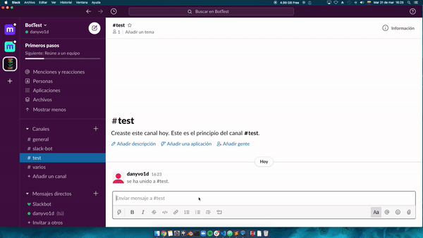
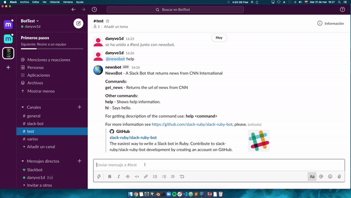
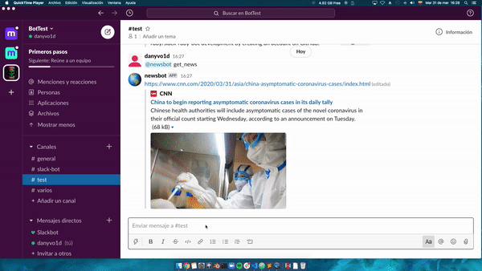

# RUBY SLACK BOT

The purpose of this project was to build a Bot with Ruby. I chose to build a Slack Bot because it's the platform I use the most for communicating with my coding mates. Also, I built this bot thinking about what could be useful for every team in Slack without necessarily getting into the tech or programming field, so that's the reason why I made a newsbot. When called, it delivers a link to a piece of news from the CNN International website.

Project: Ruby Capstone Project - Ruby Slack Bot

 

  
  <h2 align="center">NEWSBOT</h2>

  

     
    <a href="https://github.com/dansantander/ruby-slackbot"><strong>Explore the docs »</strong></a>
     
     
    ·
    <a href="https://github.com/dansantander/ruby-slackbot/issues">Report Bug</a>
    ·
    <a href="https://github.com/dansantander/ruby-slackbot/issues">Request Feature</a>
  

## Table of Contents

* [Getting Started](#getting-started)
* [About the Project](#about-the-project)
* [Built With](#built-with)
* [Acknowledgements](#acknowledgements)
* [License](#license)
* [Contact](#contact)

## Getting Started

### Prerequisites

You will need to:
- Create a Slack workspace [here](https://slack.com/create#email).
- Have a Slack API Token. You can get one by creating an app [here](http://slack.com/services/new/bot).

You should have installed:
- Ruby
- [Bundler](https://bundler.io/)

### Install

- Download or clone this project into your local machine.
- As this repository already has a Gemfile ready, you should install all the dependencies by running `bundle` in your terminal inside your project directory. You can also use the `bundle install` command for this purpose. See more about it [here](https://bundler.io/v2.0/man/bundle-install.1.html).

### Usage

To start using the bot you'll need to create a file named `.env` in the root folder and paste in your Slack API Token as follows:
`SLACK_API_TOKEN=<your token>`
Once you have everything set, you can start the bot by running `rackup` from your terminal inside the main directory.
After the bot is running you can invite it to your Slack channel like this:

And off you go!

## Commands

### help

### get_news

### get_news (topic)

## About The Project

This project was built following the next Microverse requirements:

- [x] A bot developed in Ruby
- [x] Recommended platforms: [Slack](https://github.com/slack-ruby/slack-ruby-bot), [Twitter](https://github.com/muffinista/chatterbot), [Telegram](https://github.com/atipugin/telegram-bot-ruby)
- [x] You choose the platform and the functionality of the bot
- [x] The README must include instructions on how to use the bot (how to install it and use it)

## Built With
* Ruby
* slack-Ruby-Bot
* celluloid-io
* dotenv
* puma

## Acknowledgments

This project was possible thanks to the [Slack Ruby Bot](https://github.com/slack-ruby/slack-ruby-bot) team.

## License

Distributed under the MIT License. See `LICENSE` for more information.

## Contact

Daniel Santander - [Github profile](https://github.com/dansantander) 
Project Link: [https://github.com/dansantander/ruby-slackbot](https://github.com/dansantander/ruby-slackbot)

<!-- MARKDOWN LINKS & IMAGES -->
<!-- https://www.markdownguide.org/basic-syntax/#reference-style-links -->
[contributors-shield]: https://img.shields.io/github/contributors/othneildrew/Best-README-Template.svg?style=flat-square
[contributors-url]: https://github.com/RodolfoRodriguezMata/enumerable-methods/contributors
[forks-shield]: https://img.shields.io/github/forks/othneildrew/Best-README-Template.svg?style=flat-square
[forks-url]: https://github.com/othneildrew/Best-README-Template/network/members
[stars-shield]: https://img.shields.io/github/stars/othneildrew/Best-README-Template.svg?style=flat-square
[stars-url]: https://github.com/othneildrew/Best-README-Template/stargazers
[issues-shield]: https://img.shields.io/github/issues/othneildrew/Best-README-Template.svg?style=flat-square
[issues-url]: https://github.com/othneildrew/Best-README-Template/issues
[license-shield]: https://img.shields.io/github/license/othneildrew/Best-README-Template.svg?style=flat-square
[license-url]: https://github.com/othneildrew/Best-README-Template/blob/master/LICENSE.txt
[linkedin-shield]: https://img.shields.io/badge/-LinkedIn-black.svg?style=flat-square&logo=linkedin&colorB=555
[linkedin-url]: https://linkedin.com/in/othneildrew
[product-screenshot]: images/screenshot.png